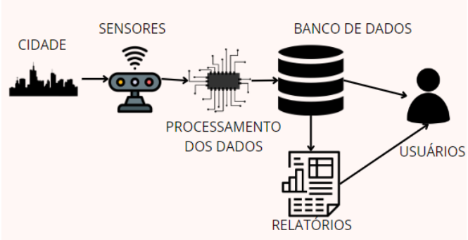
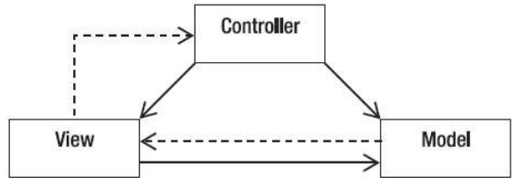

<h1 align="center">
   Sistema de Monitoramento Ambiental
</h1>

  

O projeto de Sistema de Monitoramento Ambiental tem como principal objetivo coletar, analisar e interpretar dados ambientais, como qualidade do ar, qualidade da água, níveis de ruído, clima e biodiversidade. A infraestrutura complexa e interconectada do sistema abrange a instalação de sensores em locais estratégicos, uma robusta infraestrutura de coleta de dados, sistemas de processamento e análise de dados, e a geração de relatórios personalizados para compartilhamento de informações.

## Arquitetura

A arquitetura escolhida para o Sistema de Monitoramento Ambiental é a MVC (Model-View-Controller), um padrão arquitetural amplamente utilizado no desenvolvimento de sistemas web. Essa arquitetura promove a separação de responsabilidades, facilitando a manutenção e escalabilidade do sistema. Além disso, o sistema é projetado para ser seguro, confiável, intuitivo e compatível com uma variedade de dispositivos e plataformas, seguindo padrões de dados reconhecidos internacionalmente.

  

## Funcionalidades Principais

- Coleta de dados ambientais em tempo real.
- Análise e interpretação dos dados coletados.
- Geração de relatórios personalizados.
- Segurança e confiabilidade dos dados.
- Compatibilidade com diversos dispositivos e plataformas.

